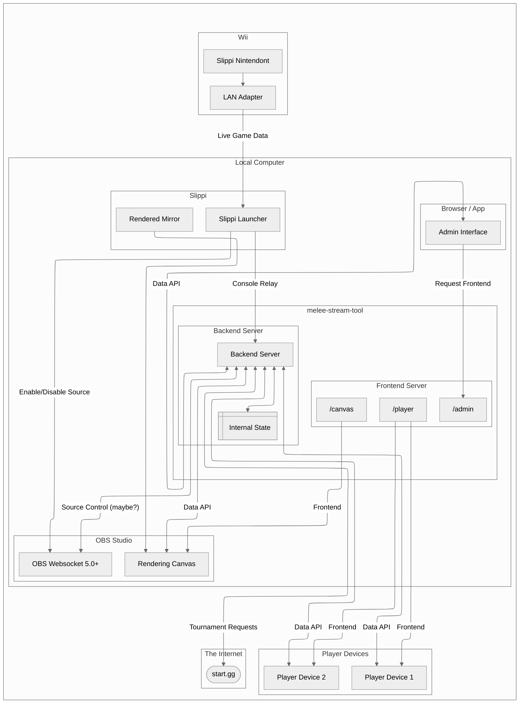
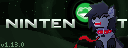
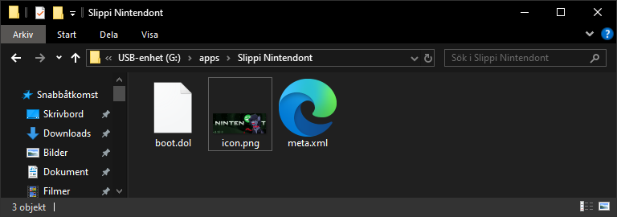
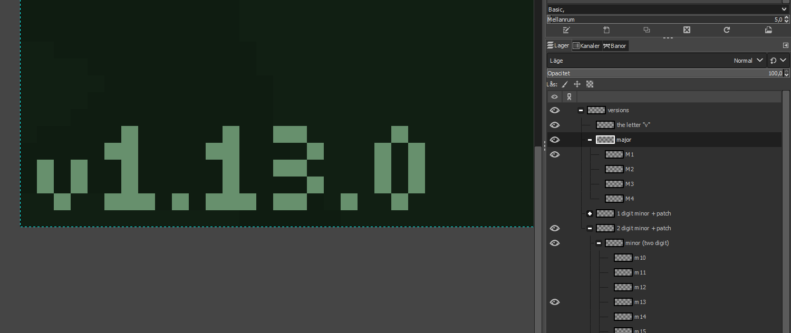

# Melee Stream Tool
The goal of this project is to provide an all-in-one stream tool for broadcasting Super Smash Brothers Melee. It spins up an administrative front-end, and OBS front-end, and a back-end that handles all the communication between services.

## Recommendations
The goal for this is to be platform-agnostic. However, I recommend utilizing VSCodium *(or VSCode if you wish to give Microsoft your data)* as it provides workspace plugin recommendations and configurations that are helpful for working within the project.

### Current VSCodium Plugins
- **Angular Language Service** *(Angular.ng-template)*
- **Markdown Preview Mermaid Support** *(bierner.markdown-mermaid)*
- **Code Spell Checker** *(streetsidesoftware.code-spell-checker)*

## Requirements
There are some prerequisite requirements before running:
- **OBS Studio 28+** (OBS Websocket 5.0+)
- A properly set up **Wii**
  - Latest version of [**Slippi Nintendont**](https://slippi.gg/downloads)
  - Has a [nickname set](extras/README_nickname.png) with the `slippi-wiiconf` app
- Latest [**Slippi Launcher**](https://slippi.gg/downloads)
  - Able to utilize Slippi's **Console Mirror** via LAN (no Wi-fi)
    - **Enable Real-time Mode** is checked and works without issue
    - **Enable Console Relay** is checked
- A **capture card** for the Wii
- **2x web-capable devices** for players to operate 
- **start.gg API key**

*...I may be forgetting something*

## Initial Architecture

## Running

WIP

## Extras

I have placed a fun variation of the Slippi Nintendont icon for the HBC app featuring myself howling at the Slippi Logo as a moon if you would like to use it.

> File: [`./extras/rei-wolf-slippi-nintendont-icon/icon.png`](extras/rei-wolf-slippi-nintendont-icon/icon.png)
> 
> 
> 

To use it, overwrite `icon.png` in the app's folder on your SD card/USB drive:

In addition, the version indicator can be changed in the [original .xcf](extras/rei-wolf-slippi-nintendont-icon/nintendont%20icon.xcf) *(the native file format for [GIMP](https://www.gimp.org/))*:

## Credits
Future contributors feel free to add yourself here:
- An uncountable number of people, animals, matter, thought, which through circumstances have led up to this point in time and space which allow me to experience a life where I am able to make this project.
- rei wolf

## License
See [LICENSE](LICENSE).